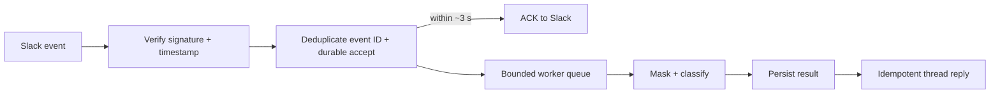

# Technical decisions

## Scope and architecture

Pitz Pulse is a modular Python 3.12 service: FastAPI handles HTTP, `RequestService` coordinates work, `aiosqlite` persists it, and one `ClassificationPipeline` owns masking, provider calls, validation, and retries. SQLite with transactional migrations supports one Docker Compose service and persistent volume. ORM, queues, PostgreSQL, and multiple workers were deferred. The database primary key reserves an ID; OpenAI runs outside the transaction. Exact raw-message equality returns completed duplicates without another call; a different message conflicts. Concurrent duplicates see `processing` until completion, then the stored result. Failed or abandoned reservations are not automatically replayed. This avoids duplicate calls in normal concurrency, not distributed exactly-once inference after crashes.

## Prompt and evaluation

Versioned files separate instructions from application logic. The model generates only semantic fields; the application supplies `id` and `version_prompt`. OpenAI strict JSON-schema output, Pydantic validation, and temperature 0 are preferable to parsing unconstrained prose. V1 gives general category, impact, ownership, language, and follow-up rules. V2 made targeted, general changes after inspecting V1 errors; it contains no Annex answers. We rejected embedding benchmark examples or continuing to tune against the same 12 messages.

On this frozen **development** benchmark, V1 and V2 both matched 47/60 discrete fields (78.33%) and 3/12 messages on all five fields. V2 corrected six errors but introduced six regressions; priority fell from 8/12 to 6/12. Spanish summaries improved from 7/12 to 9/12, below the required 12/12. V1 remains selected: V2 supplied no aggregate gain and degraded priority. The same benchmark informed V2: this is prompt-development evidence, not independent validation. Failed `v2-01` had no classifications; `v2-02` is valid. Both predate the runtime language policy; historical exports remain unchanged.

## Confidence and privacy

`confianza` is preserved in the original classification, exposed for authenticated review, and used by offline evaluation to rank low-confidence outputs and high-confidence mistakes and compare descriptive group statistics. It is **not calibrated**: high-confidence errors occurred in both runs, and 12 examples cannot justify an automatic threshold or review queue. A held-out set and measured human-review capacity should precede such a policy.

Before any provider call, a deterministic boundary masks supported email, CNPJ, Mexican RFC, and Brazilian/Mexican phone forms. The original text is stored locally for exact idempotency and authenticated human review; only the masked text is sent to OpenAI. POST and collection responses omit it; authenticated detail and PATCH responses include it. `store=False` is set on the provider request, but this is not a broad retention guarantee. Masking is selective, not anonymization: names, addresses, obfuscated or internationalized email, unsupported phone forms, context-free numbers, mistyped identifiers, prose secrets, and some RFC-like false positives remain risks. Restrict database access and retention in production; do not put PII in request IDs, which appear in structured logs.

## Costs and operating scale

Using separately verified standard API prices for `gpt-4.1-mini-2025-04-14` ($0.40/1M input, $0.10/1M cached input, $1.60/1M output tokens), V1's measured 10,699 input, 964 output, and zero cached tokens over 12 first-attempt successes imply `(10,699 × 0.40 + 964 × 1.60) / 1,000,000 = $0.005822` for the batch, about **$0.0004852/message**, **$0.2426/500 messages**, or **$24.26/50,000 messages per month**. These are retrospective/projection estimates assuming similar token mix, no cache benefit, one attempt per message, and unchanged standard pricing. They exclude hosting, storage, monitoring, retries, queueing, and human review. The historical run correctly says `cost_complete=false`: pricing was not configured during execution. Runtime cost estimates are nullable when pricing, usage, or a matching model is unavailable.

At 500/month, one service and SQLite are reasonable. At 50,000/month, capacity-plan provider quotas, asynchronous workers, monitoring, backups, and retention; measure bursts, worker utilization, and database write contention before changing storage. Monthly volume alone does not require PostgreSQL. Provider concurrency is bounded per process (default three), so distributed workers would need a shared limit.

## Reliability and proposed Slack production path

By default, calls use a configurable 15-second per-attempt timeout and three total attempts. Capped backoff and sanitized JSON attempt logs record latency, tokens, nullable cost, model, version, attempt, and error category. Transient failures, invalid classifications, and non-Spanish summaries share the retry budget; authentication/configuration errors do not. Prompt-only Spanish enforcement failed historically. New summaries pass offline `langdetect==1.0.9` after structural validation. This statistical check can falsely reject short Spanish or accept non-Spanish; retries add latency/cost. Summary-only LLM repair was deferred because another model workflow may change meaning. Explicit human summary edits follow the policy; historical records remain readable. Corrections retain original AI output and the latest human version, without actor attribution or full history.

**Proposed — not implemented:**

Stable event IDs and queue/outbox acceptance precede ACK; Slack never waits for classification. Maximum provider latencies: ~3.436 seconds (V1), ~7.327 seconds (V2). Keep provider, queue, and Slack retries distinct; deduplicate replies and route exhausted jobs to a dead-letter/operator path. Secure secrets and retention; authorize corrections. Slack is absent.

With two additional weeks, prioritize held-out multilingual evaluation and possible targeted summary repair; correction history with actor attribution; explicit recovery for failed/abandoned requests; then secure Slack ingress/queue observability and load/rate-limit testing before considering PostgreSQL or more workers.
