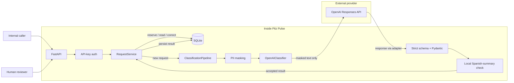

# Pitz Pulse

Pitz Pulse classifies Spanish and Portuguese internal Product & Tech requests, stores them idempotently, and lets authenticated staff inspect and correct the result. This repository implements the assessment's API, privacy boundary, evaluation workflow, and Docker delivery; it does **not** implement Slack integration or a web UI.

## How it works



Raw request text stays in local SQLite for idempotency and review; only masked request text crosses the model-provider boundary.

Python 3.12, FastAPI/Pydantic v2, the official OpenAI SDK, and explicit `aiosqlite` SQL keep the service small and testable. Numbered SQL migrations initialize during API lifespan startup. A single shared pipeline per API process supplies provider concurrency limiting; the database primary key, not process memory, decides ID ownership. No ORM, queue, or separate masking service is required for this take-home. [DECISIONES.md](DECISIONES.md) gives the trade-offs and production proposal.

## Quick start with Docker

1. If `.env` does not exist, copy `.env.example` to `.env`. Set a private `PITZ_API_KEY`; set `OPENAI_API_KEY` before making a classification request. Never commit `.env`. The API fails closed at startup if `PITZ_API_KEY` is empty; `/health` and authenticated read endpoints need no OpenAI key.
2. Run `docker compose up --build` from the repository root.
3. Check `curl http://127.0.0.1:8000/health` (expected `{"status":"ok"}`).
4. Stop with `docker compose down`.

Compose exposes only `127.0.0.1:8000` on the host. The non-root container runs `uvicorn app.api.main:app --host 0.0.0.0 --port 8000`; migrations run on startup. SQLite lives at `/data/pitz-pulse.sqlite3` in the `pitz_data` named volume, which survives `docker compose down` and container recreation. Do not use `docker compose down -v` if you need that data. The healthcheck is static, unauthenticated, and does not call OpenAI. The image excludes `.env`, local databases, assessment material, caches, and evaluation evidence.

## Configuration

`Settings.from_env()` reads the repository's local `.env` at runtime; process environment values win. Compose passes `.env` and sets `DATABASE_PATH` to `/data/pitz-pulse.sqlite3`. Defaults below come from [app/config.py](app/config.py) and [.env.example](.env.example):

| Variable | Default / purpose |
| --- | --- |
| `PITZ_API_KEY` | Empty; required for API startup and `X-API-Key` authentication. |
| `OPENAI_API_KEY` | Empty; needed only when real classification is attempted. |
| `OPENAI_MODEL` | `gpt-4.1-mini-2025-04-14`; configurable model. |
| `PROMPT_VERSION` | `v3`; selected prompt. `v1`, `v2`, and `v4` are preserved but not selected. |
| `MODEL_TIMEOUT_SECONDS` | `15` per attempt. |
| `MODEL_MAX_ATTEMPTS` | `3` total attempts, including the first. |
| `MODEL_CONCURRENCY_LIMIT` | `3` provider calls per process. |
| `MODEL_BACKOFF_BASE_SECONDS` | `0.5` seconds. |
| `MODEL_BACKOFF_MAX_SECONDS` | `8` seconds. |
| `OPENAI_INPUT_PRICE_PER_MILLION` | Empty; input-token price for the configured model. |
| `OPENAI_OUTPUT_PRICE_PER_MILLION` | Empty; output-token price; set with input price. |
| `OPENAI_CACHED_INPUT_PRICE_PER_MILLION` | Empty; optional cached-input price. |
| `DATABASE_PATH` | `data/pitz-pulse.sqlite3` locally; Compose overrides it. |

The official runs did not configure prices, so their saved `cost_complete=false` remains accurate. For a **new** run using the stated standard prices for this model, the three pricing variables can be set to `0.40`, `1.60`, and `0.10` respectively; do not retroactively edit historical artifacts. Runtime estimated cost is null if pricing or usage is unavailable or the returned model differs from the configured priced model.

## API

`GET /health` needs no key. All `/solicitudes` routes require `X-API-Key: <your PITZ_API_KEY>`. The examples below use a placeholder; replace it with the private value you configured. **POST invokes the real model for a new ID and can incur cost.**

```bash
curl http://127.0.0.1:8000/health
curl -X POST http://127.0.0.1:8000/solicitudes \
  -H 'X-API-Key: REPLACE_WITH_YOUR_KEY' -H 'Content-Type: application/json' \
  -d '{"id":"DEMO-001","mensaje":"El checkout falla para algunos usuarios."}'
curl -H 'X-API-Key: REPLACE_WITH_YOUR_KEY' \
  'http://127.0.0.1:8000/solicitudes?categoria=bug&prioridad=alta&area=backend&limit=20&offset=0'
curl -H 'X-API-Key: REPLACE_WITH_YOUR_KEY' \
  http://127.0.0.1:8000/solicitudes/DEMO-001
curl -X PATCH http://127.0.0.1:8000/solicitudes/DEMO-001 \
  -H 'X-API-Key: REPLACE_WITH_YOUR_KEY' -H 'Content-Type: application/json' \
  -d '{"prioridad":"media"}'
```

POST accepts only `id` and `mensaje`: new completed request `201`, identical completed request `200`, existing processing request `202` with `Retry-After`, same ID/different **exact raw string** `409`, and previously failed request `503` without reclassification. Missing/invalid key returns `401`; invalid input/correction `422`; absent detail/correction target `404`. Provider/internal errors return sanitized `503` responses. The collection lists completed requests; its `categoria`, `prioridad`, and `area` filters apply to the effective classification (original AI result merged with the latest human correction). Filters combine with AND and paginate with `limit` (default 20, max 100) and `offset` (default 0). Results are ordered by creation time descending, then ID descending.

The original AI classification and provider metadata stay immutable. PATCH merges allowed partial semantic corrections over the latest correction (or AI result) and updates effective category/priority/area; it does not replace AI confidence or prompt version. Only the latest correction is retained. POST and collection responses omit raw `mensaje`; authenticated detail and PATCH responses include it for human review.

## Privacy and reliability

The pipeline masks supported email, CNPJ, Mexican RFC, and common Brazilian/Mexican phone forms **before** the provider boundary. Only masked text reaches OpenAI. The original is stored in local SQLite for exact idempotency and review; no duplicate masked-message copy is stored. The provider request uses `store=False`, which is not a blanket provider-retention guarantee. Masking is not comprehensive anonymization: names, addresses, obfuscated/internationalized emails, unsupported phones, context-free numbers, mistyped identifiers, prose secrets, and RFC-like false positives remain possible. Keep access to the database and request IDs appropriately controlled.

For **new classifications**, structural validation is followed by the offline `langdetect==1.0.9` Spanish-summary acceptance policy (`spanish-summary-v1`). A non-Spanish or undetermined `resumen` consumes the existing bounded retry budget; explicitly edited human summaries use the same policy. Historical records remain readable and unrelated corrections do not revalidate their summaries. The detector is statistical, not a language guarantee: short Spanish summaries can be falsely rejected, and false acceptance remains possible. No text is sent to a second service for detection.

API startup enables content-free JSON logging for subsequent model attempts: ID, model, prompt version, attempt, latency, tokens, nullable cost, success, and sanitized error type. The logger does not add the `mensaje` payload, masked input, prompt, model output, or key; IDs themselves must be nonsensitive because they are logged. Requests time out after 15 seconds per attempt by default; eligible transient/invalid-result failures get bounded exponential-backoff retries. Failed or interrupted DB reservations are not automatically replayed, and no crash-recovery operator workflow exists yet.

## Local development and tests

From the repository root with Python 3.12:

```bash
python3.12 -m venv .venv
.venv/bin/python -m pip install -e '.[dev]'
test -f .env || cp .env.example .env
# Set PITZ_API_KEY in .env; set OPENAI_API_KEY only for real classification.
.venv/bin/uvicorn app.api.main:app --host 127.0.0.1 --port 8000
```

Run the quality suite:

```bash
.venv/bin/python -m pytest
.venv/bin/pytest
.venv/bin/ruff check .
.venv/bin/ruff format --check .
```

The test suite uses deterministic fakes and a global network blocker; it does not call the real model API.

## Evaluation evidence

The frozen 12-message **development** set is [evaluation/messages.json](evaluation/messages.json); human reference labels and ambiguity notes are in [etiquetas_esperadas.json](etiquetas_esperadas.json). Scoring joins by ID and exact-scores only `categoria`, `prioridad`, `area_sugerida`, `idioma`, and `requiere_info`; missing/failed items stay in the denominator. `resumen` and follow-up text require qualitative review. [resultados.json](resultados.json) is the selected **V3** export; the original V1 export is preserved at [evaluation/runs/v1-01/resultados.json](evaluation/runs/v1-01/resultados.json).

| Evidence | Category | Priority | Area | Language | Needs info | Exact fields | All five | Spanish summaries |
| --- | ---: | ---: | ---: | ---: | ---: | ---: | ---: | ---: |
| **Selected V3 (`v3-01`)** | 9/12 | 8/12 | 9/12 | 11/12 | 8/12 | **45/60 (75.00%)** | 3/12 | **12/12** |
| Previous V1 (`v1-01`) | 10/12 | 8/12 | 9/12 | 12/12 | 8/12 | **47/60 (78.33%)** | 3/12 | **7/12** |
| Valid V2 (`v2-02`) | 11/12 | 6/12 | 10/12 | 12/12 | 8/12 | **47/60 (78.33%)** | 3/12 | **9/12** |
| Rejected V4 (`v4-01`) | 7/12 | 6/12 | 7/12 | 10/12 | 7/12 | 37/60 (61.67%) | 2/12 | 2 of 12 failed |

**Why V3 is selected.** After the runtime Spanish-summary policy was added, V1 failed every Portuguese request in live use: it wrote `resumen` in Portuguese, the policy rejected it, and three near-identical temperature-0 attempts ended in `503`. Under the current runtime, V1 would classify only 7 of the 12 Annex messages. V3 is V1 plus one appended output-language rule, and a test enforces that nothing else changed. In `v3-01` all 12 messages succeeded on the first attempt with 12/12 Spanish summaries and complete cost accounting, at 45/60 exact fields versus V1's 47/60. The two regressions are MSG-05 `categoria` (`bug` → `datos`, a label already documented as ambiguous) and MSG-09 `idioma` (`es` → `pt`). Ad-hoc probes outside the benchmark (not stored as evidence) showed that V3 can label very short Spanish messages that start with "Oigan," as `pt`. V4 added an `idioma` clarification that fixed those probes, but in `v4-01` MSG-02 and MSG-08 again produced Portuguese summaries and failed, so V4 was rejected. V3 is selected because it is the only evaluated prompt that classifies all 12 messages under the runtime contract; its `idioma` error on short Spanish messages is a known limitation.

Earlier history: V2 corrected six V1 field errors and introduced six new regressions, with worse priority accuracy, so V1 was kept at that time. The same 12 messages informed V2, so comparison is prompt-development evidence, not independent validation or generalization. `v2-01` is a preserved DNS/network infrastructure failure (36 connection-failed attempts, zero classifications); `v2-02` is the valid 12/12-successful V2 experiment. The V1 and V2 runs predate the local runtime policy, so their files were neither repaired nor regenerated: V1 has only 7/12 Spanish summaries and V2 has 9/12.

V1 confidence averages were 0.9167 for fully matching messages and 0.8833 for disagreements; V2 averages were 0.9333 and 0.9111. High-confidence mistakes exist. Confidence is stored, exposed for review, and analyzed offline, **not calibrated** or used for an automatic review threshold.

Safe offline commands (no provider call, no historical run-file rewrite):

```bash
.venv/bin/python -m evaluation.cli score --results resultados.json
.venv/bin/python -m evaluation.cli score --results evaluation/runs/v2-02/resultados.json
.venv/bin/python -m evaluation.cli compare \
  --baseline evaluation/runs/v1-01 --candidate evaluation/runs/v2-02
```

For a **new, explicitly authorized live** evaluation, configure `OPENAI_API_KEY` and choose an unused run ID; this makes paid provider calls and writes a new run directory. Do not rerun or overwrite the preserved official IDs:

```bash
.venv/bin/python -m evaluation.cli run --prompt-version v3 --run-id my-new-run-01 --live
.venv/bin/python -m evaluation.cli export \
  --run-dir evaluation/runs/my-new-run-01 \
  --output evaluation/runs/my-new-run-01/resultados.json
```

Export requires 12 validated successes, which is why `v4-01` has no export. Per-run `run.json`, `report.json`, and `model_calls.jsonl` preserve safe provenance and attempt evidence. The selected V3 run was executed with the standard prices configured, so its accounting is complete: 11,299 input and 948 output tokens, zero cached tokens, 12 first-attempt successes, **$0.0060364/batch**, about **$0.000503/message**, **$0.25/500**, or **$25.15/50,000 similar messages/month**. V1 measured a similar 10,699 input and 964 output tokens (about $0.000485/message), but its artifacts report incomplete monetary accounting because prices were not configured during that run. These estimates exclude retries, hosting, storage, monitoring, queueing, and human review. `evaluation.cli compare` only accepts runs with identical execution settings, so V3 (priced, runtime language policy) was compared with V1 per message from the exported results rather than with that command.

## Limits and assessment artifacts

Remaining priorities: assess the statistical Spanish-summary policy on an independent multilingual holdout and consider targeted repair if needed; add correction history/actor attribution and recovery for failed or abandoned reservations; then design secure asynchronous Slack ingress and load-test before changing database architecture. Current SQLite and process-local concurrency are deliberate take-home trade-offs. The Docker base image and transitive dependencies are not fully locked, so image-level reproducibility is limited. Slack Events, queueing, dead-letter handling, and a web UI are **proposals, not implemented features**.

- [Selected V3 output](resultados.json) and [human labels](etiquetas_esperadas.json)
- [Selected prompt V3](prompts/v3.md); preserved [V1](prompts/v1.md), [V2](prompts/v2.md), and [rejected V4](prompts/v4.md)
- [Selected V3 run](evaluation/runs/v3-01/), [V1 run](evaluation/runs/v1-01/), [failed V2 infrastructure run](evaluation/runs/v2-01/), [valid V2 run](evaluation/runs/v2-02/), and [rejected V4 run](evaluation/runs/v4-01/)
- [Technical decisions](DECISIONES.md), [AI-use log](AI_LOG.md), and [configuration template](.env.example)

The assessment's optional conversation-export link is not included; [AI_LOG.md](AI_LOG.md) records the relevant AI-assisted decisions without exposing unrelated account history. The confidential assessment PDF is intentionally excluded from Git.
